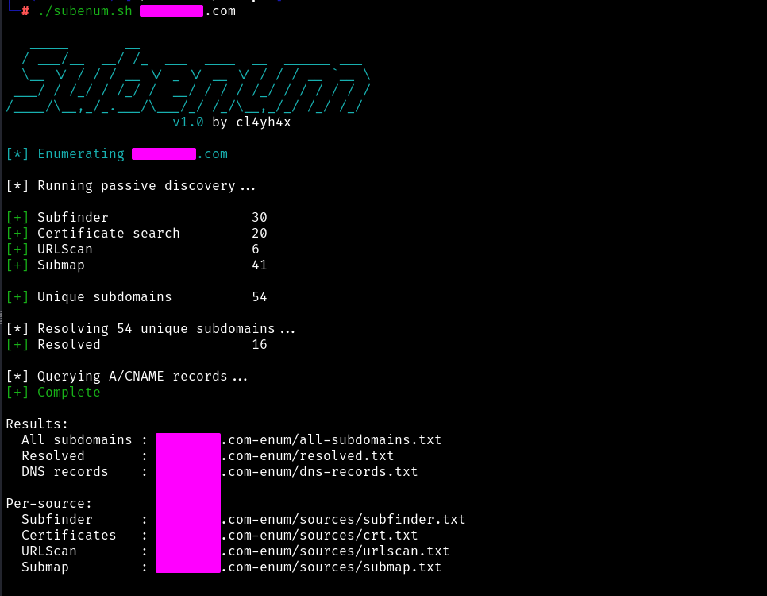

# subenum

`subenum` is a Bash-based subdomain enumeration utility that combines multiple passive discovery sources, normalizes and deduplicates the results, resolves discovered subdomains, and collects A and CNAME DNS records.

## Features

- Passive subdomain discovery using:
  - Subfinder
  - crt.name
  - URLScan
  - Submap
- Per-source normalization and deduplication
- Global deduplication before DNS resolution
- DNS resolution with PureDNS
- A and CNAME record collection with dnsx
- Per-source result files
- Custom resolver support

## Requirements

The following tools must be installed and available in `$PATH`:

- `subfinder`
- `puredns`
- `dnsx`
- `curl`
- `jq`

A resolver file is also required. The default path is:

```text
~/scripts/resolvers.txt
```

A different resolver file can be specified with `-r` or `--resolvers`.

## Usage

```text
./subenum.sh <domain> [options]
```

Example:

```bash
./subenum.sh example.com
```

Specify a resolver file:

```bash
./subenum.sh example.com --resolvers ~/scripts/resolvers.txt
```

Disable the banner:

```bash
./subenum.sh example.com --no-banner
```

## Workflow

```text
Subfinder ─────┐
crt.name ──────┤
URLScan ───────┼──> Normalize + per-source deduplication
Submap ────────┘
                         │
                         ▼
                  Global deduplication
                         │
                         ▼
                  all-subdomains.txt
                         │
                         ▼
                      PureDNS
                         │
                         ▼
                     resolved.txt
                         │
                         ▼
                       dnsx
                         │
                         ▼
                  dns-records.txt
```

DNS resolution occurs only after all passive discovery sources have completed and the combined results have been deduplicated.

## Output

For a target such as `example.com`, results are stored under:

```text
example.com-enum/
├── sources/
│   ├── subfinder.txt
│   ├── crt.txt
│   ├── urlscan.txt
│   └── submap.txt
├── all-subdomains.txt
├── resolved.txt
└── dns-records.txt
```

### Result files

- `all-subdomains.txt` — all unique subdomains discovered across every source.
- `resolved.txt` — discovered subdomains that successfully resolve.
- `dns-records.txt` — A and CNAME information collected by dnsx.
- `sources/` — normalized and deduplicated results from each individual discovery source.

## Example

<p align="center">
  
</p>

## Third-Party Services

Some enumeration methods query third-party services. Target domains submitted to these services may be visible to the service operators.

Ensure that use of third-party services is appropriate for your engagement and authorization requirements.

## Disclaimer

This tool is intended for authorized security testing and research. Users are responsible for ensuring they have permission to enumerate the systems and domains they target.

## License

MIT License
